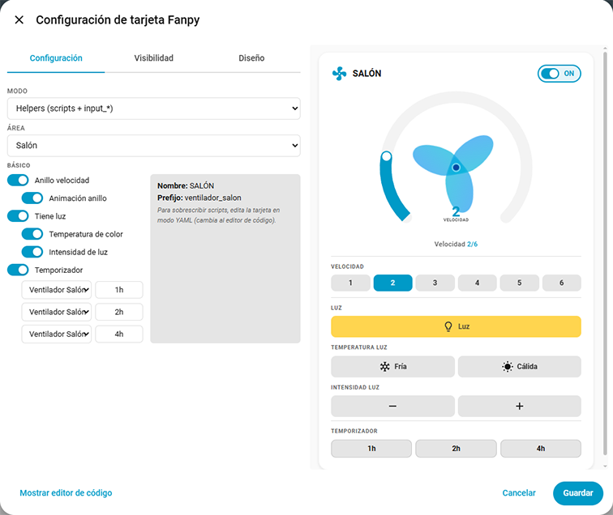
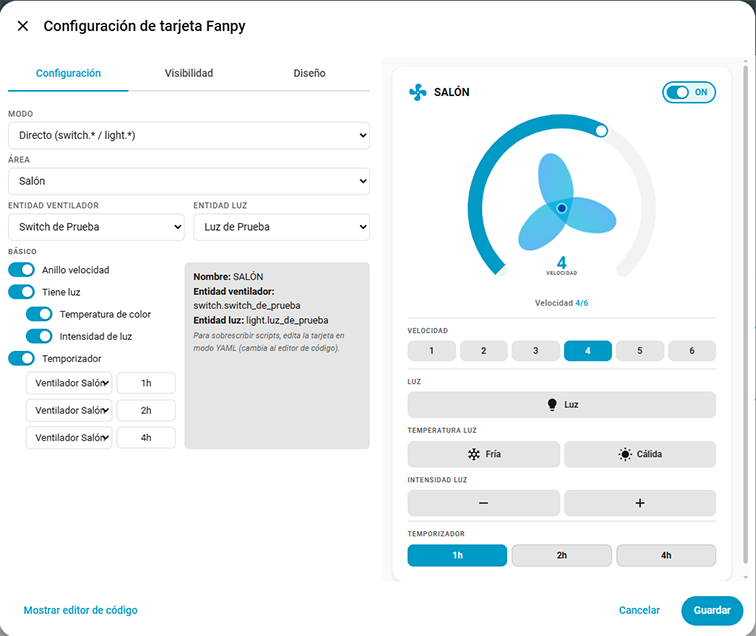
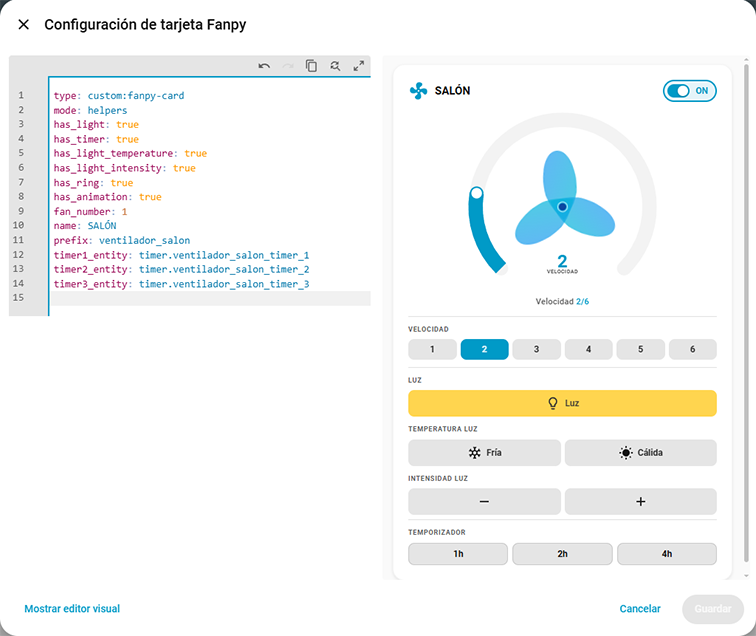
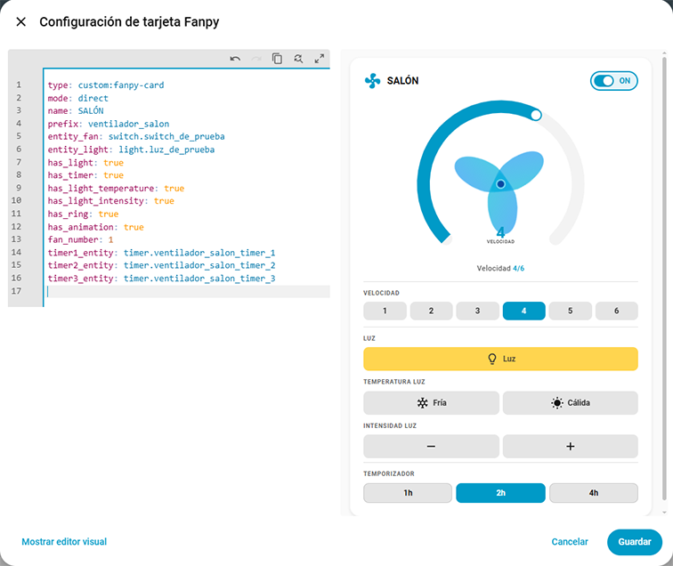
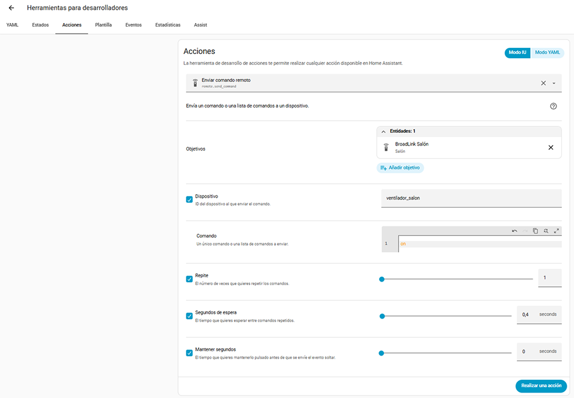
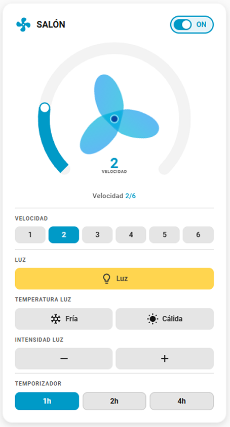
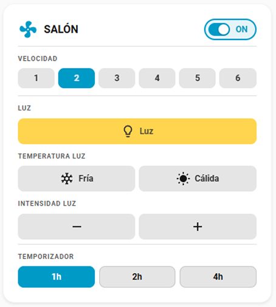

# Fanpy Card


[](https://opensource.org/licenses/Apache-2.0)

[](https://github.com/hacs/plugin)
[](https://github.com/figorr/fanpy-card/actions/workflows/release.yml)


Fanpy Card is a custom Lovelace card for Home Assistant to control ceiling fans with light and speed settings.

## Background

This card was born from a real need. I bought some ceiling fans that weren't smart — they worked via RF remote control. I discovered I could make them smart by using a **Broadlink RM4 Pro** to learn the RF commands and integrate them into Home Assistant.

After teaching the commands to HA, I created **scripts** to execute them. Voice control worked, but I wanted a proper dashboard card. I couldn't find an existing card that fit my needs, so I built this one.

The card evolved to support multiple setups:

- **Helpers mode** — the original design using `input_boolean`, `input_select`, `binary_sensor` entities + Broadlink RF scripts
- **Direct mode** — for Shelly or native `switch.*` / `light.*` entities, no scripts needed for power/light
- **Fanpy** (Remote / Direct) — works with the [Fanpy integration](https://github.com/figorr/fanpy) v3.0.0+ (Broadlink RF)
- **Fanpy PRO** (Remote / Direct) — works with the [fanpypro integration](https://github.com/figorr/fanpypro) using an ESPHome RF gateway (ESP32 + CC1101) instead of Broadlink

## Features

- ✅ **Six modes**: Helpers, Direct, Fanpy Remote, Fanpy Direct, Fanpy PRO Remote, Fanpy PRO Direct
- ✅ Control fan power (on/off)
- ✅ Control light (on/off, warm/cold temperature, brightness up/down)
- ✅ **SVG speed ring** with drag interaction — change speed by sliding on the ring arc
- ✅ **Speed buttons** synchronized with the ring — tap for quick speed selection
- ✅ Spinning fan animation with speed-dependent rotation
- ✅ **Timer section** — up to 3 configurable timer buttons with editable labels. Uses native `timer.start`/`timer.cancel` services. Button count dynamically read from `select.{fanpy_prefix}<prefix>_num_timers` (e.g., `select.fanpypro_ventilador_salon_num_timers`, set via the integration config flow).
- ✅ **Rollback** on failed commands — ring returns to previous position if the service/script call fails
- ✅ **Entity validation** before calling services — rejects non-existent entities immediately
- ✅ Visual editor with mode selector, area dropdown, fan number, toggle switches, and timer labels
- ✅ Multi-language support (en, es, ca)
- ✅ Script override for non-standard setups
- ✅ Direct service calls for temperature and brightness (direct / fanpy_direct modes)
- ✅ Always shows the spinning fan icon (even with 1 speed), hides controls when only 1 speed
- ✅ Fanpy integration support — auto-discovers areas with Fanpy entities

## Modes Overview

| Mode | Setup | Power | Light | Speed | RF Method |
|------|-------|-------|-------|-------|-----------|
| **Helpers** | Custom | Scripts → RF | Scripts → RF | Scripts → RF | Broadlink |
| **Direct** | Custom | `switch.turn_on/off` | `light.turn_on/off` | Scripts → RF | Broadlink |
| **Fanpy Remote** | Fanpy | `fan.turn_on/off` (via integration) | `light.turn_on/off` (via integration) | `fan.set_percentage` (via integration) | Broadlink |
| **Fanpy Direct** | Fanpy | `switch.turn_on/off` | `light.turn_on/off` | Scripts → Broadlink RF | Broadlink |
| **Fanpy PRO Remote** | Fanpy PRO | `fan.turn_on/off` (via integration) | `light.turn_on/off` (via integration) | `fan.set_percentage` (via integration) | ESPHome RF Gateway |
| **Fanpy PRO Direct** | Fanpy PRO | `switch.turn_on/off` | `light.turn_on/off` | Scripts → ESPHome RF | ESPHome RF Gateway |

Speed always requires RF scripts (even in Direct modes) because changing fan speed typically requires sending RF commands. In **Fanpy Remote** and **Fanpy PRO Remote** modes, the card calls `fan.set_percentage`, which internally triggers the RF command. In **Fanpy Direct** and **Fanpy PRO Direct** modes, the card calls speed scripts directly — matching the behavior of `helpers` and `direct` modes.

## Installation

### HACS (Recommended) — Not available yet

1. Open HACS.
2. Search for **Fanpy Card** and install it.
3. Refresh the Lovelace.

### Manual

1. Download the `fanpy-card.zip` from the latest release.
2. Unzip and copy `fanpy-card.js` to your Home Assistant `www` folder:
   ```
   /config/www/fanpy-card/fanpy-card.js
   ```
3. Add the resource in **Settings > Dashboards > Resources > Add Resource**:
   - URL: `/local/fanpy-card/fanpy-card.js`
   - Type: `module`
4. Refresh (Ctrl+F5 / Cmd+Shift+R).

## Configuration

### Visual Editor

The visual editor adapts to the selected setup and mode. At the top of the editor panel there are two dropdowns:

- **Setup**: `Fanpy PRO` / `Fanpy` / `Custom` — determines which integration the card works with
- **Mode**: shows 2 options filtered by the selected setup

#### Setup: Fanpy PRO

Works with the [fanpypro integration](https://github.com/figorr/fanpypro) using an ESPHome RF gateway (ESP32 + CC1101). The editor scans HA entities for existing fanpypro configurations (`select.fanpypro_ventilador_*_velocidad`).

1. Select the **Area** and **Fan #** from the auto-detected configs
2. In **Fanpy PRO Direct** mode, entities are auto-populated from the config flow
3. Configure toggle switches (light, temperature, intensity, ring, timer)

#### Setup: Fanpy

Works with the [Fanpy integration](https://github.com/figorr/fanpy) (Broadlink RF). The editor scans HA entities for existing Fanpy configurations (`select.fanpy_ventilador_*_velocidad`).

1. Select the **Area** and **Fan #** from the auto-detected configs
2. In **Fanpy Direct** mode, you must select **Fan entity** (`switch.*`) and **Light entity** (`light.*`)
3. Configure toggle switches

When you select a Fanpy setup, the editor auto-detects the correct prefix (`fanpy_` or `fanpypro_`) from the area's entities and sets the mode accordingly.

#### Helpers Mode

Select the **Area** from the dropdown. The name and prefix are auto-generated:
- **Name**: area name (e.g., `SALÓN`)
- **Prefix**: `ventilador_{area}` (e.g., `ventilador_salon`)

Use the toggle switches to show/hide light, temperature, and intensity controls.

To override scripts, switch to the **code editor** (YAML mode).



#### Direct Mode

Select the **Name** from the area list, then choose the **Fan entity** (`switch.*`) and **Light entity** (`light.*`) from their dropdowns.

Use the toggle switches to enable/disable light, color temperature, and intensity controls.

Temperature and intensity buttons call `light.turn_on` directly with `color_temp` / `brightness_step_pct` parameters — no scripts needed.

Speed buttons appear automatically when the speed entity exists in your HA instance.



### YAML Examples

#### Fanpy Remote Mode

```yaml
type: custom:fanpy-card
mode: fanpy_remote
name: "BODEGA"
prefix: "ventilador_bodega"
fan_number: 1
has_light: true
has_light_temperature: true
has_light_intensity: true
num_timers: 3
timer1_entity: timer.ventilador_bodega_timer_1
timer1_label: "1h"
timer2_entity: timer.ventilador_bodega_timer_2
timer2_label: "2h"
timer3_entity: timer.ventilador_bodega_timer_3
timer3_label: "4h"
```



#### Fanpy PRO Remote Mode

```yaml
type: custom:fanpy-card
mode: fanpypro_remote
name: "SALON"
prefix: "ventilador_salon"
fan_number: 1
has_light: true
has_light_temperature: true
has_light_intensity: true
num_timers: 3
timer1_entity: timer.ventilador_salon_timer_1
timer1_label: "1h"
timer2_entity: timer.ventilador_salon_timer_2
timer2_label: "2h"
timer3_entity: timer.ventilador_salon_timer_3
timer3_label: "4h"
```

#### Fanpy PRO Direct Mode

```yaml
type: custom:fanpy-card
mode: fanpypro_direct
name: "SALON"
prefix: "ventilador_salon"
fan_number: 1
entity_fan: switch.shelly_salon
entity_light: light.shelly_salon_luz
has_light: true
num_timers: 2
timer1_entity: timer.ventilador_salon_timer_1
timer1_label: "1h"
timer2_entity: timer.ventilador_salon_timer_2
timer2_label: "2h"
```

#### Fanpy Direct Mode

```yaml
type: custom:fanpy-card
mode: fanpy_direct
name: "BODEGA"
prefix: "ventilador_bodega"
fan_number: 1
entity_fan: switch.shelly_bodega
entity_light: light.shelly_bodega_luz
has_light: true
has_light_temperature: false
has_light_intensity: false
num_timers: 2
timer1_entity: timer.ventilador_bodega_timer_1
timer1_label: "1h"
timer2_entity: timer.ventilador_bodega_timer_2
timer2_label: "2h"
```



#### Helpers Mode

```yaml
type: custom:fanpy-card
name: "SALÓN"
prefix: "ventilador_salon"
has_light: true
has_light_temperature: true
has_light_intensity: true
has_ring: true  # set to false to hide the SVG ring and show only speed buttons
# Optional: override specific scripts if they differ from the auto-generated names
# power_on_script: "script.mi_script_personalizado"
# power_off_script: "script.otro_script_apagar"
```

#### Direct Mode

```yaml
type: custom:fanpy-card
mode: direct
name: "LAVABO ROSA"
entity_fan: switch.lavabo_rosa_ventilador
entity_light: light.lavabo_rosa_luz
has_light: true
has_light_temperature: false
has_light_intensity: false
```

### Configuration Options

| Option | Type | Default | Modes | Description |
|--------|------|---------|-------|-------------|
| `mode` | string | `"fanpypro_remote"` | all | Card mode: `"fanpypro_remote"`, `"fanpypro_direct"`, `"fanpy_remote"`, `"fanpy_direct"`, `"helpers"`, or `"direct"` |
| `name` | string | — | all | Display name for the fan (e.g., `SALÓN`) |
| `prefix` | string | — | fanpypro_remote, fanpypro_direct, fanpy_remote, helpers, fanpy_direct | Entity ID prefix (e.g., `ventilador_salon`) |
| `fan_number` | number | `1` | fanpypro_remote, fanpypro_direct, fanpy_remote, fanpy_direct | Fan number within an area (1–5) |
| `entity_fan` | string | — | direct, fanpy_direct | Fan entity ID (e.g. `switch.lavabo_rosa_ventilador`) |
| `entity_light` | string | — | direct, fanpy_direct | Light entity ID (e.g. `light.lavabo_rosa_luz`) |
| `has_light` | boolean | `true` | all | Show/hide the light section |
| `has_light_temperature` | boolean | `true` (helpers/fanpy_remote/fanpypro_remote) / `false` (direct/fanpy_direct/fanpypro_direct) | all | Show/hide color temperature buttons |
| `has_light_intensity` | boolean | `true` (helpers/fanpy_remote/fanpypro_remote) / `false` (direct/fanpy_direct/fanpypro_direct) | all | Show/hide brightness buttons |
| `has_ring` | boolean | `true` | all | Show/hide the SVG speed ring and status text. When disabled, only the speed number buttons are shown |
| `has_animation` | boolean | `true` | all | Animate the fan blades inside the ring. Disabled automatically when `has_ring` is off |
| `power_on_script` | string | — | fanpypro_remote, fanpy_remote, helpers | Override: power ON script (default: `script.{prefix}_power_on`) |
| `power_off_script` | string | — | fanpypro_remote, fanpy_remote, helpers | Override: power OFF script (default: `script.{prefix}_power_off`) |
| `luz_on_script` | string | — | fanpypro_remote, fanpy_remote, helpers | Override: light ON script (default: `script.{prefix}_luz_on`) |
| `luz_off_script` | string | — | fanpypro_remote, fanpy_remote, helpers | Override: light OFF script (default: `script.{prefix}_luz_off`) |
| `luz_fria_script` | string | — | fanpypro_remote, fanpy_remote, helpers | Override: cold light script (default: `script.{prefix}_luz_fria`) |
| `luz_calida_script` | string | — | fanpypro_remote, fanpy_remote, helpers | Override: warm light script (default: `script.{prefix}_luz_calida`) |
| `intensidad_baja_script` | string | — | fanpypro_remote, fanpy_remote, helpers | Override: dim down script (default: `script.{prefix}_intensidad_baja`) |
| `intensidad_alta_script` | string | — | fanpypro_remote, fanpy_remote, helpers | Override: dim up script (default: `script.{prefix}_intensidad_alta`) |
| `velocidad_{n}_script` | string | — | all | Override: speed {n} script (default: `script.{prefix}_velocidad_{n}`) |
| `num_timers` | number | `3` | all | Number of timer buttons to show (0–3, read from `select.fanpy_<prefix>_num_timers` if available; falls back to this config value) |
| `has_timer` | boolean | `true` | all | Show/hide the timer section (overridden by `num_timers` when 0) |
| `timer1_entity` | string | — | all | Timer entity ID for button 1 (e.g. `timer.ventilador_salon_timer_1`). Falls back to `timer.{prefix}_timer_1` |
| `timer2_entity` | string | — | all | Timer entity ID for button 2 |
| `timer3_entity` | string | — | all | Timer entity ID for button 3 |
| `timer1_label` | string | `"1h"` | all | Label for timer button 1 (calls `timer.start` on `timer1_entity`) |
| `timer2_label` | string | `"2h"` | all | Label for timer button 2 (calls `timer.start` on `timer2_entity`) |
| `timer3_label` | string | `"4h"` | all | Label for timer button 3 (calls `timer.start` on `timer3_entity`) |

### Auto-generated Entity & Script Names (Helpers / Fanpy Remote / Fanpy PRO Remote)

If no override is specified, the card auto-generates names from the prefix:

| Entity | Auto-generated ID |
|--------|------------------|
| Power state (helpers) | `input_boolean.{prefix}_power` |
| Light state (helpers) | `input_boolean.{prefix}_luz` |
| Fan entity (fanpy_remote / fanpypro_remote) | `fan.{fanpy_prefix}{prefix}` |
| Light entity (fanpy_remote / fanpypro_remote) | `light.{fanpy_prefix}{prefix}_luz` |
| Speed selector | `{domain}.{fanpy_prefix}{prefix}_velocidad` |
| Power sensor (helpers) | `binary_sensor.{prefix}_power` |
| Light sensor (helpers) | `binary_sensor.{prefix}_luz` |
| Power ON | `script.{prefix}_power_on` |
| Power OFF | `script.{prefix}_power_off` |
| Light ON | `script.{prefix}_luz_on` |
| Light OFF | `script.{prefix}_luz_off` |
| Cold light | `script.{prefix}_luz_fria` |
| Warm light | `script.{prefix}_luz_calida` |
| Dim down | `script.{prefix}_intensidad_baja` |
| Dim up | `script.{prefix}_intensidad_alta` |
| Speed 1–N | `script.{prefix}_velocidad_{1-N}` |

Where `{fanpy_prefix}` is `fanpy_` for Fanpy modes, `fanpypro_` for Fanpy PRO modes, and empty for helpers mode.  
Where `{domain}` is `input_select` (helpers) or `select` (fanpy / fanpypro modes).  
In **Fanpy Remote** / **Fanpy PRO Remote**, `binary_sensor` entities are not created — the card reads `fan.{fanpy_prefix}{prefix}` and `light.{fanpy_prefix}{prefix}_luz` directly for state. In **Fanpy Direct** / **Fanpy PRO Direct**, the card reads `switch.*` and `light.*` specified via `entity_fan` / `entity_light`.

### Helpers Mode — Required Entities

For the card to work in Helpers mode you must manually create:

- **`input_boolean.{prefix}_power`** — tracks fan power state
- **`input_boolean.{prefix}_luz`** — tracks light state
- **`binary_sensor.{prefix}_power`** — tracks power sensor state
- **`binary_sensor.{prefix}_luz`** — tracks light sensor state
- **`input_select.{prefix}_velocidad`** — tracks speed, with options `1`, `2`, `3`, etc. (one per speed level)
- All the **scripts** below (they send RF commands and update the helper entities)

### Helpers Mode — Scripts Example (Broadlink RF)

Below is a real `scripts.yaml` example for a ceiling fan with 6 speeds and light (temperature + intensity), controlled via a Broadlink RM4 Pro.

Each script sends the RF command and updates the corresponding helper entity so the card reflects the correct state.

<details>
<summary>Click to expand scripts.yaml (14 scripts)</summary>

```yaml
ventilador_salon_power_on:
  sequence:
  - action: remote.send_command
    metadata: {}
    data:
      num_repeats: 1
      delay_secs: 0.4
      hold_secs: 0
      device: ventilador_salon
      command: 'on'
    target:
      device_id: YOUR_BROADLINK_DEVICE_ID
  - action: input_boolean.turn_on
    metadata: {}
    data: {}
    target:
      entity_id: input_boolean.ventilador_salon_power
  alias: Ventilador Salón Power ON
  description: ''

ventilador_salon_power_off:
  sequence:
  - action: remote.send_command
    metadata: {}
    data:
      num_repeats: 1
      delay_secs: 0.4
      hold_secs: 0
      device: ventilador_salon
      command: 'off'
    target:
      device_id: YOUR_BROADLINK_DEVICE_ID
  - action: input_boolean.turn_off
    metadata: {}
    data: {}
    target:
      entity_id: input_boolean.ventilador_salon_power
  alias: Ventilador Salón Power OFF
  description: ''

ventilador_salon_luz_on:
  sequence:
  - action: remote.send_command
    metadata: {}
    target:
      entity_id: remote.broadlink_salon
    data:
      num_repeats: 1
      delay_secs: 0.4
      hold_secs: 0
      device: ventilador_salon
      command: luz
  - action: input_boolean.turn_on
    metadata: {}
    target:
      entity_id: input_boolean.ventilador_salon_luz
    data: {}
  alias: Ventilador Salón Luz ON
  description: ''

ventilador_salon_luz_off:
  sequence:
  - action: remote.send_command
    metadata: {}
    data:
      num_repeats: 1
      delay_secs: 0.4
      hold_secs: 0
      device: ventilador_salon
      command: luz
    target:
      entity_id: remote.broadlink_salon
  - action: input_boolean.turn_off
    metadata: {}
    data: {}
    target:
      entity_id: input_boolean.ventilador_salon_luz
  alias: Ventilador Salon Luz OFF
  description: ''

ventilador_salon_luz_calida:
  sequence:
  - action: remote.send_command
    metadata: {}
    data:
      num_repeats: 1
      delay_secs: 0.4
      hold_secs: 0
      device: ventilador_salon
      command: luz_calida
    target:
      device_id: YOUR_BROADLINK_DEVICE_ID
  alias: Ventilador Salón Luz Cálida
  description: ''

ventilador_salon_luz_fria:
  sequence:
  - action: remote.send_command
    metadata: {}
    data:
      num_repeats: 1
      delay_secs: 0.4
      hold_secs: 0
      device: ventilador_salon
      command: luz_fria
    target:
      device_id: YOUR_BROADLINK_DEVICE_ID
  alias: Ventilador Salón Luz Fría
  description: ''

ventilador_salon_intensidad_alta:
  sequence:
  - action: remote.send_command
    metadata: {}
    data:
      num_repeats: 1
      delay_secs: 0.4
      hold_secs: 0
      device: ventilador_salon
      command: intensidad_alta
    target:
      device_id: YOUR_BROADLINK_DEVICE_ID
  alias: Ventilador Salón Intensidad Alta
  description: ''

ventilador_salon_intensidad_baja:
  sequence:
  - action: remote.send_command
    metadata: {}
    data:
      num_repeats: 1
      delay_secs: 0.4
      hold_secs: 0
      device: ventilador_salon
      command: intensidad_baja
    target:
      device_id: YOUR_BROADLINK_DEVICE_ID
  alias: Ventilador Salón Intensidad Baja
  description: ''

ventilador_salon_velocidad_1:
  sequence:
  - action: remote.send_command
    metadata: {}
    data:
      num_repeats: 1
      delay_secs: 0.4
      hold_secs: 0
      device: ventilador_salon
      command: velocidad1
    target:
      device_id: YOUR_BROADLINK_DEVICE_ID
  - action: input_select.select_option
    metadata: {}
    data:
      option: '1'
    target:
      entity_id: input_select.ventilador_salon_velocidad
  - action: input_boolean.turn_on
    metadata: {}
    target:
      entity_id: input_boolean.ventilador_salon_power
    data: {}
  alias: Ventilador Salón Velocidad 1
  description: ''

ventilador_salon_velocidad_2:
  sequence:
  - action: remote.send_command
    metadata: {}
    data:
      num_repeats: 1
      delay_secs: 0.4
      hold_secs: 0
      device: ventilador_salon
      command: velocidad2
    target:
      device_id: YOUR_BROADLINK_DEVICE_ID
  - action: input_select.select_option
    metadata: {}
    data:
      option: '2'
    target:
      entity_id: input_select.ventilador_salon_velocidad
  - action: input_boolean.turn_on
    metadata: {}
    target:
      entity_id: input_boolean.ventilador_salon_power
    data: {}
  alias: Ventilador Salón Velocidad 2
  description: ''

ventilador_salon_velocidad_3:
  sequence:
  - action: remote.send_command
    metadata: {}
    data:
      num_repeats: 1
      delay_secs: 0.4
      hold_secs: 0
      device: ventilador_salon
      command: velocidad3
    target:
      device_id: YOUR_BROADLINK_DEVICE_ID
  - action: input_select.select_option
    metadata: {}
    data:
      option: '3'
    target:
      entity_id: input_select.ventilador_salon_velocidad
  - action: input_boolean.turn_on
    metadata: {}
    target:
      entity_id: input_boolean.ventilador_salon_power
    data: {}
  alias: Ventilador Salón Velocidad 3
  description: ''

ventilador_salon_velocidad_4:
  sequence:
  - action: remote.send_command
    metadata: {}
    data:
      num_repeats: 1
      delay_secs: 0.4
      hold_secs: 0
      device: ventilador_salon
      command: velocidad4
    target:
      device_id: YOUR_BROADLINK_DEVICE_ID
  - action: input_select.select_option
    metadata: {}
    data:
      option: '4'
    target:
      entity_id: input_select.ventilador_salon_velocidad
  - action: input_boolean.turn_on
    metadata: {}
    target:
      entity_id: input_boolean.ventilador_salon_power
    data: {}
  alias: Ventilador Salón Velocidad 4
  description: ''

ventilador_salon_velocidad_5:
  sequence:
  - action: remote.send_command
    metadata: {}
    data:
      num_repeats: 1
      delay_secs: 0.4
      hold_secs: 0
      device: ventilador_salon
      command: velocidad5
    target:
      device_id: YOUR_BROADLINK_DEVICE_ID
  - action: input_select.select_option
    metadata: {}
    data:
      option: '5'
    target:
      entity_id: input_select.ventilador_salon_velocidad
  - action: input_boolean.turn_on
    metadata: {}
    target:
      entity_id: input_boolean.ventilador_salon_power
    data: {}
  alias: Ventilador Salón Velocidad 5
  description: ''

ventilador_salon_velocidad_6:
  sequence:
  - action: remote.send_command
    metadata: {}
    data:
      num_repeats: 1
      delay_secs: 0.4
      hold_secs: 0
      device: ventilador_salon
      command: velocidad6
    target:
      device_id: YOUR_BROADLINK_DEVICE_ID
  - action: input_select.select_option
    metadata: {}
    data:
      option: '6'
    target:
      entity_id: input_select.ventilador_salon_velocidad
  - action: input_boolean.turn_on
    metadata: {}
    target:
      entity_id: input_boolean.ventilador_salon_power
    data: {}
  alias: Ventilador Salón Velocidad 6
  description: ''
```

</details>

It is important the script will call the exact device and command learned with the **`remote.learn_command`**.

You can test the learned command using the **`remote.send_command`**.

- **Broadlink learn command example:**

  

- **Broadlink send command test example:**

  

## Card Preview

The card renders a compact control panel with an SVG speed ring. Example layout with all sections visible:

```
┌─────────────────────────────┐
│ 🌀 SALÓN             ● ON   │
│                             │
│      ╭─────────────╮        │
│    ╱  ╱           ╲  ╲      │
│   │  │    🌀       │  │     │
│   │  │      3      │  │     │
│   │  │  VELOCIDAD  │  │     │
│    ╲  ╲           ╱  ╱      │
│      ╰─────────────╯        │
│      Speed 3/6              │
│  ───────────────────────    │
│  1   2   3   4   5   6      │
│                             │
│ LUZ                         │
│          [💡]               │
│                             │
│ TEMPERATURA LUZ             │
│     [❄️]         [☀️]      │
│                             │
│ INTENSIDAD LUZ              │
│     [−]         [+]         │
│                             │
│ TIMER                       │
│    [1h]   [2h]   [4h]       │
└─────────────────────────────┘
```

- The SVG speed ring shows the active speed as a 270° arc. Drag on the ring to change speed, or tap the number buttons below.
- The fan icon at the center spins when the fan is ON, with speed-dependent animation.
- Active speed is highlighted with the theme accent color.
- Light button shows yellow when light is on.
- Timer section is optional (`has_timer: false` / `num_timers: 0`) and calls native `timer.start`/`timer.cancel` on the configured timer entities. Each button label is configurable (`timer1_label` etc.).

### Timer Expiry Behaviour

When a timer finishes naturally (countdown reaches zero), the card automatically turns off the fan. This works differently depending on the mode:

| Mode | Handled by | Notes |
|------|------------|-------|
| **Fanpy Remote** / **Fanpy Direct** / **Fanpy PRO Remote** / **Fanpy PRO Direct** | Fanpy / fanpypro integration (backend) | Automatic — the integration listens for HA's `timer.finished` event and turns off the fan/switch. Works even if the card is not visible or the app is in the background. |
| **Helpers** / **Direct** | Card (frontend only) | The card detects the timer transition `active → idle` and calls the power-off action. Only works when the card is actively rendered and receiving state updates (card visible and app in foreground). |

> For **Helpers** and **Direct** modes, it is recommended to create an HA automation so timer expiry works reliably regardless of card visibility. This is not needed for Fanpy or Fanpy PRO modes — the integration handles it automatically.
> ```yaml
> automation:
>   - alias: "Apagar ventilador cuando timer finalice"
>     trigger:
>       - platform: event
>         event_type: timer.finished
>         event_data:
>           entity_id: "timer.ventilador_salon_timer_1"
>     action:
>       - action: script.ventilador_salon_power_off
> ```
> Create one automation per timer entity. This is not needed for Fanpy modes — the integration handles it automatically.
- Sections can be hidden via toggle switches in the editor or YAML options.

  - **Card example**

    

  - **Card example (without speed ring)**

    

## Development

```bash
# Clone
git clone https://github.com/figorr/fanpy-card.git
cd fanpy-card

# Install dependencies
npm install

# Build
npm run build

# Watch mode
npm run watch
```

## Translations

To add a new language:

1. Create `src/translations/{lang}.json` with the same keys as `en.json`.
2. Add the import in `src/translations.js`.
3. Submit a PR.

## Contributing

See [CONTRIBUTING.md](CONTRIBUTING.md).

## License

Apache-2.0. See [LICENSE](LICENSE).
