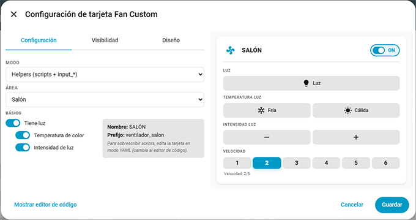
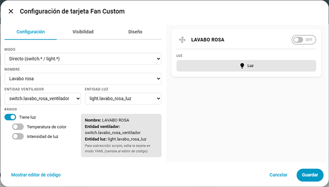
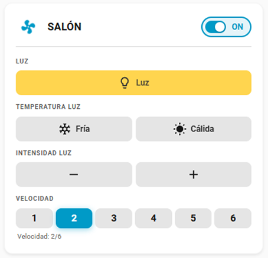

# Fan Custom Card

[](https://opensource.org/licenses/Apache-2.0)
[](https://github.com/hacs/plugin)

Custom Lovelace card for Home Assistant to control ceiling fans with light and speed settings.

## Features

- ✅ **Two modes**: Helpers (scripts + `input_*` entities) and Direct (native `switch.*` / `light.*` entities)
- ✅ Control fan power (on/off)
- ✅ Control light (on/off, warm/cold temperature, brightness up/down)
- ✅ Speed selection (1-6) with dynamic button count
- ✅ Spinning fan animation with speed-dependent rotation
- ✅ Visual editor with mode selector, area dropdown, and toggle switches
- ✅ Multi-language support (en, es, ca)
- ✅ Script override for non-standard setups (helpers mode)
- ✅ Direct service calls for temperature and brightness (direct mode)
- ✅ Auto-detected speed section — create `input_select.{prefix}_velocidad` and buttons appear

## Installation

### HACS (Recommended)

1. Open HACS.
2. Search for **Fan Custom Card** and install it.
3. Refresh the Lovelace.

### Manual

1. Download the `fan-custom-card.zip` from the latest release.
2. Unzip and copy `fan-custom-card.js` to your Home Assistant `www` folder:
   ```
   /config/www/fan-custom-card/fan-custom-card.js
   ```
3. Add the resource in **Settings > Dashboards > Resources > Add Resource**:
   - URL: `/local/fan-custom-card/fan-custom-card.js`
   - Type: `module`
4. Refresh (Ctrl+F5 / Cmd+Shift+R).

## Configuration

### Visual Editor

The editor has two modes selectable at the top.

#### Helpers Mode

Select the **Area** from the dropdown. The name and prefix are auto-generated:
- **Name**: area name (e.g., `SALÓN`)
- **Prefix**: `ventilador_{area}` (e.g., `ventilador_salon`)

Use the toggle switches to show/hide light, temperature, and intensity controls.

To override scripts, switch to the **code editor** (YAML mode).



#### Direct Mode

Select the **Name** from the area list, then choose the **Fan entity** (`switch.*`) and **Light entity** (`light.*`) from their dropdowns.

Use the toggle switches to enable/disable light, color temperature, and intensity controls.

Temperature and intensity buttons call `light.turn_on` directly with `color_temp` / `brightness_step_pct` parameters — no scripts needed.

Speed buttons appear automatically when `input_select.{prefix}_velocidad` exists in your HA instance.



### YAML Examples

#### Helpers Mode

```yaml
type: custom:fan-custom-card
name: "SALÓN"
prefix: "ventilador_salon"
has_light: true
has_light_temperature: true
has_light_intensity: true
# Optional: override specific scripts if they differ from the auto-generated names
# power_on_script: "script.mi_script_personalizado"
# power_off_script: "script.otro_script_apagar"
```

#### Direct Mode

```yaml
type: custom:fan-custom-card
mode: direct
name: "LAVABO ROSA"
entity_fan: switch.lavabo_rosa_ventilador
entity_light: light.lavabo_rosa_luz
has_light: true
has_light_temperature: false
has_light_intensity: false
```

### Configuration Options

| Option | Type | Default | Description |
|--------|------|---------|-------------|
| `mode` | string | `"helpers"` | Card mode: `"helpers"` (scripts + `input_*`) or `"direct"` (`switch.*` / `light.*`) |
| `name` | string | — | Display name for the fan (e.g., `SALÓN`) |
| `prefix` | string | — | Entity ID prefix (e.g., `ventilador_salon`). Auto-generated from name in direct mode |
| `entity_fan` | string | — | Fan entity ID (direct mode only, e.g. `switch.lavabo_rosa_ventilador`) |
| `entity_light` | string | — | Light entity ID (direct mode only, e.g. `light.lavabo_rosa_luz`) |
| `has_light` | boolean | `true` | Show/hide the light section |
| `has_light_temperature` | boolean | `true` (helpers) / `false` (direct) | Show/hide color temperature buttons |
| `has_light_intensity` | boolean | `true` (helpers) / `false` (direct) | Show/hide brightness buttons |
| `power_on_script` | string | — | Override: power ON script (helpers mode, default: `script.{prefix}_power_on`) |
| `power_off_script` | string | — | Override: power OFF script (helpers mode, default: `script.{prefix}_power_off`) |
| `luz_on_script` | string | — | Override: light ON script (helpers mode, default: `script.{prefix}_luz_on`) |
| `luz_off_script` | string | — | Override: light OFF script (helpers mode, default: `script.{prefix}_luz_off`) |
| `luz_fria_script` | string | — | Override: cold light script (helpers mode, default: `script.{prefix}_luz_fria`) |
| `luz_calida_script` | string | — | Override: warm light script (helpers mode, default: `script.{prefix}_luz_calida`) |
| `intensidad_baja_script` | string | — | Override: dim down script (helpers mode, default: `script.{prefix}_intensidad_baja`) |
| `intensidad_alta_script` | string | — | Override: dim up script (helpers mode, default: `script.{prefix}_intensidad_alta`) |
| `velocidad_{n}_script` | string | — | Override: speed {n} script (default: `script.{prefix}_velocidad_{n}`) |

### Helpers Mode — Auto-generated Entity & Script Names

If no override is specified, the card auto-generates names from the prefix:

| Entity | Auto-generated ID |
|--------|------------------|
| Power state | `input_boolean.{prefix}_power` |
| Light state | `input_boolean.{prefix}_luz` |
| Speed state | `input_select.{prefix}_velocidad` |
| Power ON | `script.{prefix}_power_on` |
| Power OFF | `script.{prefix}_power_off` |
| Light ON | `script.{prefix}_luz_on` |
| Light OFF | `script.{prefix}_luz_off` |
| Cold light | `script.{prefix}_luz_fria` |
| Warm light | `script.{prefix}_luz_calida` |
| Dim down | `script.{prefix}_intensidad_baja` |
| Dim up | `script.{prefix}_intensidad_alta` |
| Speed 1-6 | `script.{prefix}_velocidad_{1-6}` |

## Card Preview

The card renders a compact control panel. Example layout with all sections visible:

```
┌─────────────────────────────┐
│ 🌀 SALÓN             ● ON   │
│                             │
│ LUZ                         │
│          [💡]               │
│                             │
│ TEMPERATURA LUZ             │
│     [❄️]         [☀️]      │
│                             │
│ INTENSIDAD LUZ              │
│     [−]         [+]         │
│                             │
│ VELOCIDAD                   │
│  1   2   3   4   5   6      │
│         ●                   │
│       Speed 3/6             │
└─────────────────────────────┘
```

- The fan icon spins when the fan is ON, with speed depending on the selected velocity.
- Active speed is highlighted with the theme accent color.
- Light button shows yellow when light is on.
- Sections can be hidden via toggle switches in the editor or `has_light`, `has_light_temperature`, `has_light_intensity` YAML options.



## Development

```bash
# Clone
git clone https://github.com/figorr/fan-custom-card.git
cd fan-custom-card

# Install dependencies
npm install

# Build
npm run build

# Watch mode
npm run watch
```

## Translations

To add a new language:

1. Create `src/translations/{lang}.json` with the same keys as `en.json`.
2. Add the import in `src/translations.js`.
3. Submit a PR.

## Contributing

See [CONTRIBUTING.md](CONTRIBUTING.md).

## License

Apache-2.0. See [LICENSE](LICENSE).
